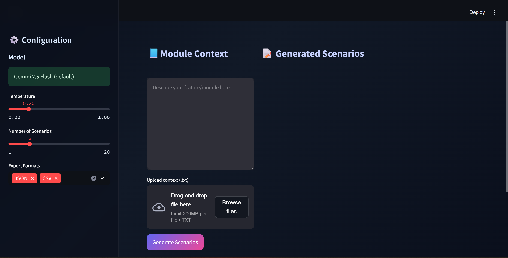
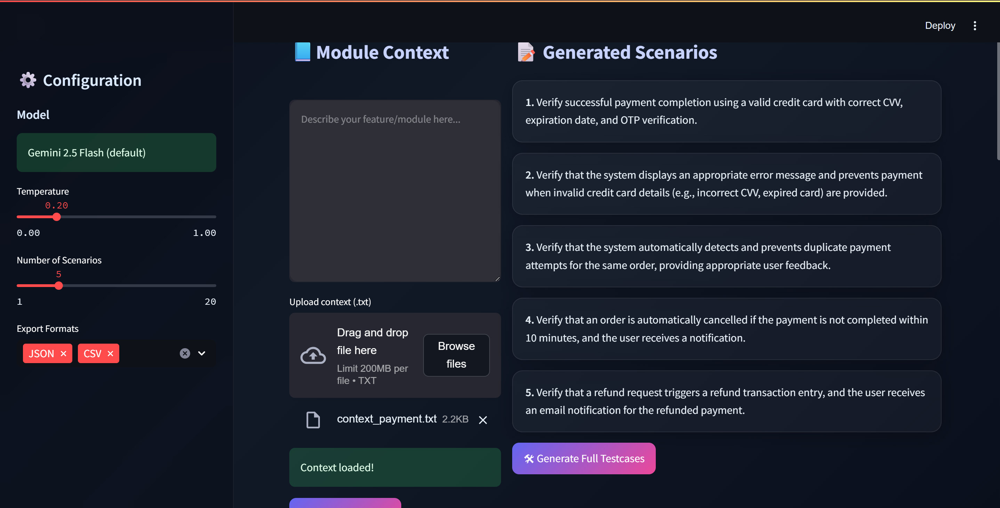
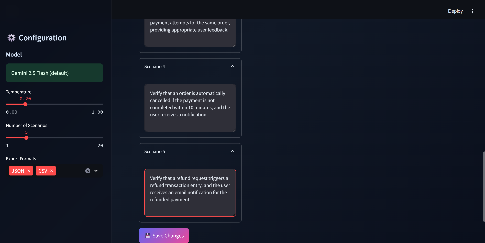
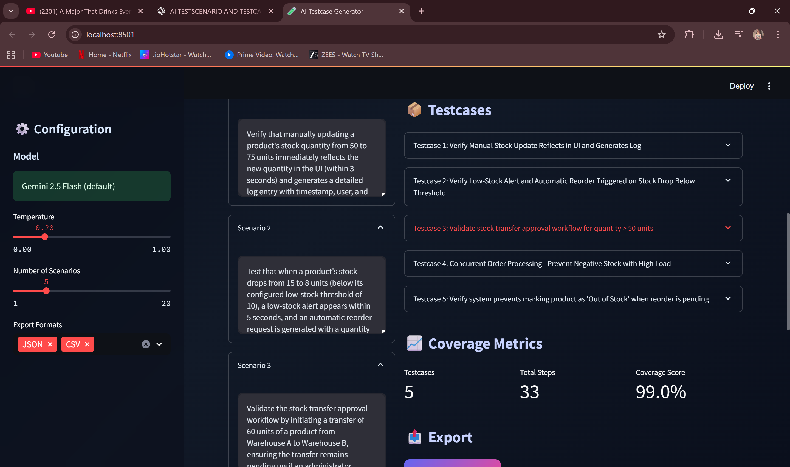

🧪 AI-Powered Testcase & Scenario Generator

Generate high-quality QA scenarios and full testcases with Google Gemini 2.5

🚀 Overview

The AI Testcase & Scenario Generator is a modern Streamlit-based application that uses Google Gemini 2.5 Flash to generate:

✔ High-quality QA test scenarios
✔ Detailed testcases (steps + expected results)
✔ Editable scenarios
✔ AI-powered “Improve Scenario” button
✔ JSON / CSV / Markdown / ZIP export options
✔ Functional coverage metrics
✔ Clean premium UI

This tool helps QA engineers, developers, and SDETs generate comprehensive testcases in seconds.

✨ Features

🧠 AI-Generated Content

Generate test scenarios from feature descriptions

Generate full structured testcases

Improve scenarios instantly using AI

✍️ Scenario Editor

Modify scenarios

Auto-update session

One-click improve and revert options

🎨 Premium UI (Glassmorphism)

Beautiful dark UI

Gradient buttons

Smooth cards, tabs, metrics

Modern two-column layout

📄 Testcase Viewer

JSON View

Markdown View

Steps Card View

📊 Functional Coverage Dashboard

Total testcases

Total steps

Coverage score

Average complexity

📦 Export Options

JSON

CSV

Markdown

Full ZIP bundle

🔧 Tech Stack

Python 3.10+

Streamlit

Google Gemini 2.5 Flash API

Pandas / NumPy

Custom CSS (Glass UI)

Render / Streamlit Cloud deployment ready

📁 Project Structure

AIPowered_TestScenario_TestCase_Generator
│
├── app/
│ ├── streamlit_app.py
│ ├── gemini_generator.py
│ ├── json_cleanup.py
│ ├── export_testcases.py
│ ├── config.py
│ └── utils/
│ ├── validations.py
│ └── prompts.py
│
├── outputs/
│ └── exports/
│
├── samples/
│ ├── context_auth.txt
│ ├── context_payment.txt
│ └── context_inventory.txt
│
├── .env.example
├── Procfile
├── render.yaml
├── requirements.txt
├── README.md
└── setup.sh

⚙️ Installation (Local)

Clone the repository
git clone https://github.com/
<your-username>/AI-Testcase-Generator.git

Navigate to the folder
cd AI-Testcase-Generator

Create virtual environment
python -m venv venv
venv\Scripts\activate (Windows)
source venv/bin/activate (Mac/Linux)

Install dependencies
pip install -r requirements.txt

Create your .env file in root
GEMINI_API_KEY=your_key_here

Run the app
streamlit run app/streamlit_app.py

🌐 Deploy on Render

Push your project to GitHub

Login to https://render.com

Create New → Web Service

Select your repo

Render auto-loads render.yaml

Add environment variable
GEMINI_API_KEY=your_key

Deploy

Live web link:

📸 Screenshots

<video controls src="AIPOWERED_TESTSCENARIO_TESTCASE_GENERATOR_RECORDING.mp4" title="Title"></video>

Scenario Generation

🔐 Environment Variables

GEMINI_API_KEY — your Google Gemini API key

🧠 Improve Scenario with AI

Each scenario block includes an “Improve Scenario” button that:

makes scenarios clearer

adds boundary conditions

rewrites vague scenarios

ensures better testcase quality

📦 Export Formats

JSON — import into automation tools

CSV — Excel, Sheets

Markdown — for documentation

ZIP Bundle — entire set packaged together

📜 License

MIT License © 2025 Your Name
